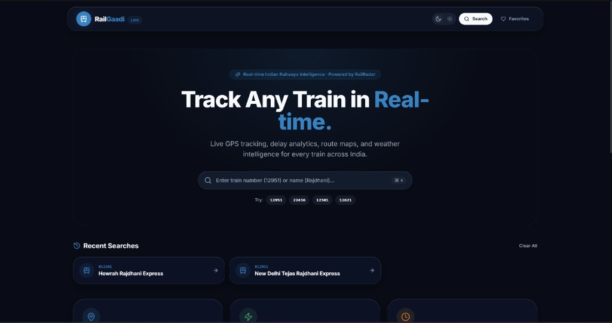
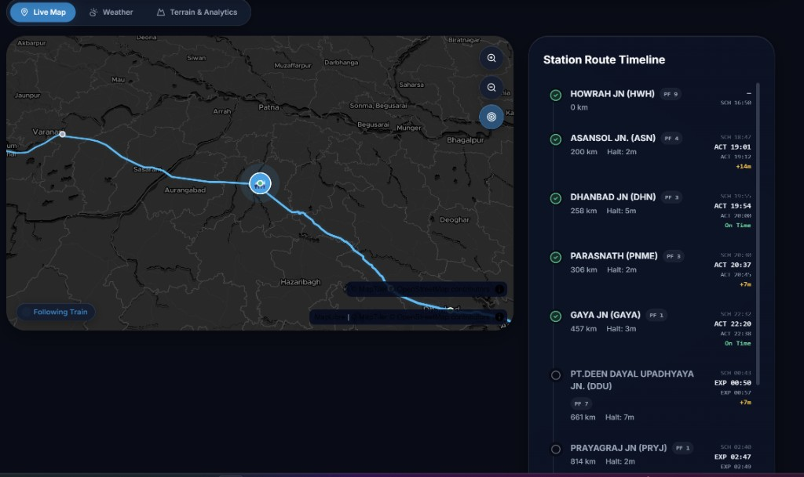
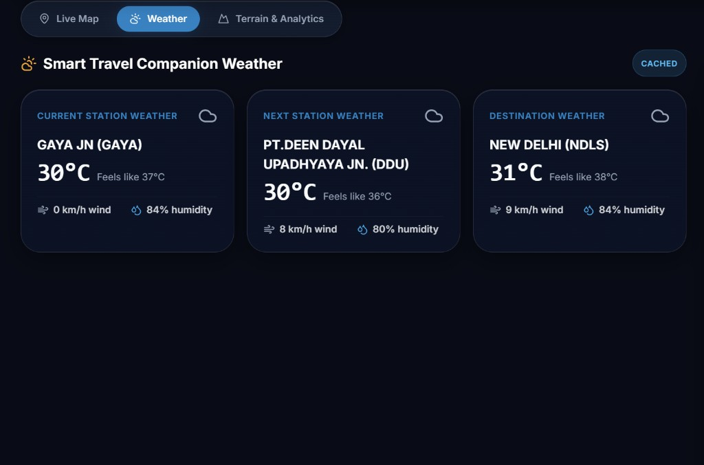
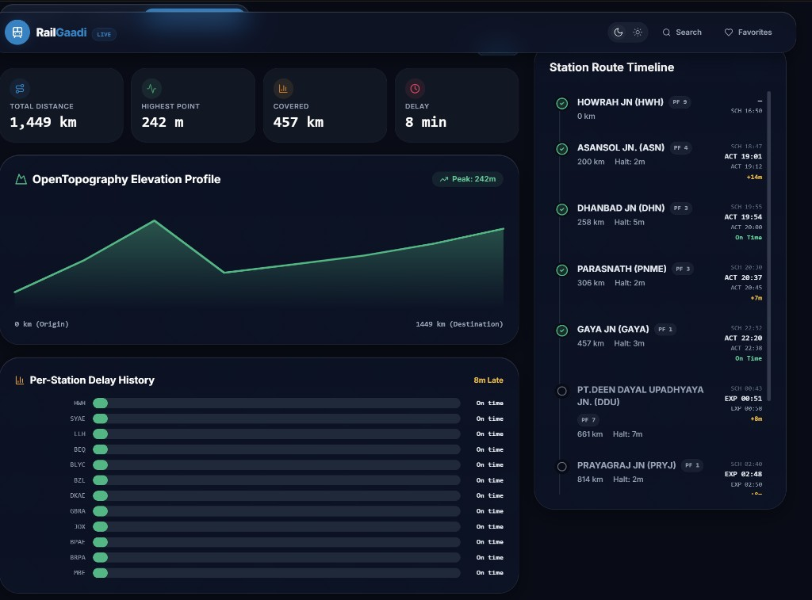

# RailGaadi

**Live Indian train tracking with maps, timeline, weather, and terrain — with an explicit data-source model so live provider data is never confused with cache, fallback, or estimated values.**

---

## Overview

RailGaadi is a Next.js 14 web app for following Indian Railways journeys in the browser. Search a train, open a live journey page, and see position, halt timeline, delay labels, weather at the current location, elevation, and OSM-derived terrain along the route.

Live tracking comes from [RailRadar](https://api.railradar.in). Maps use MapTiler (MapLibre) with a CARTO raster fallback. Weather, elevation, and terrain use OpenWeather, OpenTopography, and Overpass/OSM. Upstash Redis (optional) shares cache, rate limits, and the daily RailRadar budget across instances.

The product problem is not “show a map.” It is **honest tracking under quota and failure**: RailRadar is budgeted, APIs time out, and synthetic data exists for development and secondary layers. Every successful API payload carries `dataSource: live | cached | fallback | unavailable` so the UI can badge what you are looking at.

Tagged release: [`v1.0.0`](https://github.com/sumandey7684/Railgaadi/releases/tag/v1.0.0).

---

## Key features

- **Search** popular trains from a bundled local catalogue; live RailRadar lookup only when local search misses (server) or for non-numeric queries with no local hits (client).
- **Live journey** at `/train/[id]`: status, delay, progress, ETA, MapLibre map, halt timeline.
- **Time provenance** on each halt: scheduled / actual / expected (`SCH` / `ACT` / `EXP`), plus estimated delay when inherited rather than reported.
- **Position provenance**: GPS, station, interpolated along route geometry, or fallback.
- **Weather** at the current coordinates (OpenWeather, or a static fallback sample).
- **Terrain & analytics**: Overpass POIs along the corridor, OpenTopography elevation profile, delay history from halt data.
- **Share page** at `/share/[id]` (same live journey API; Web Share or clipboard).
- **Favorites and recent searches** in the browser (Zustand + `localStorage`).
- **Auto-refresh** every 30 seconds (toggleable).
- **Light / dark theme** with FOUC-free init and liquid-glass chrome.
- **PWA manifest** (`standalone`, search and favorites shortcuts).
- **Quota-aware backend**: IP rate limit, daily RailRadar budget, 30s journey cache, in-flight coalescing.

---

## Screenshots

<p align="center">
  
</p>

<p align="center"><em>Home — search by number or name, recent trains, theme toggle</em></p>

<p align="center">
  
</p>

<p align="center"><em>Live map + halt timeline — SCH / ACT / EXP times, delay labels, follow-train</em></p>

<p align="center">
  
</p>

<p align="center"><em>Weather — current, next halt, and destination; data-source badge (cached)</em></p>

<p align="center">
  
</p>

<p align="center"><em>Terrain & analytics — elevation profile, delay history, distance and delay summary</em></p>

---

## Architecture and data flow

```
Browser (App Router)
  TanStack Query  →  GET /api/*
  Zustand          →  auto-refresh, follow-train, favorites, recents
  MapLibre         →  MapTiler style or CARTO dark tiles
        │
        ▼
Next.js middleware  →  45 req / 60s / IP  (Redis or process memory)
        │
        ▼
Route handlers
  /api/search
  /api/train/[id]      ─┐
  /api/analytics/[id]  ─┼─ loadCachedLiveJourney (30s cache + inflight Map)
  /api/terrain         ─┘
  /api/weather
        │
        ├─ Upstash Redis  rg:cache:*  rg:ratelimit:*  rg:budget:railradar:YYYY-MM-DD
        │                 (memory fallback if Redis unset or errors)
        │
        └─ Providers
              RailRadar   live + route GeoJSON   (budget: 2 units / journey, 1 / search)
              OpenWeather current weather
              OpenTopography  SRTMGL3 samples
              Overpass    corridor POIs
```

Train IDs that are not **4–5 digits** never reach RailRadar (`parseTrainId`).

`loadCachedLiveJourney` is the single server path for train, analytics, and terrain so a page load does not fire three live RailRadar trips.

---

## Tech stack

| Layer | Choice |
| --- | --- |
| App | Next.js 14 (App Router), React 18, TypeScript |
| Styling | Tailwind CSS, liquid-glass tokens in `styles/globals.css` |
| Data fetching | TanStack Query v5 |
| Client state | Zustand (persist for favorites / recents) |
| Map | MapLibre GL, MapTiler `dataviz-dark` |
| Geometry | Turf / local `lib/geo.ts` |
| Cache / limits | `@upstash/redis` REST |
| Motion | Framer Motion, GSAP (footer) |
| Tests | Vitest (Node) |
| CI | GitHub Actions (`pnpm`, Node 20) |

Provider HTTP is server-only except `NEXT_PUBLIC_MAPTILER_API_KEY`.

---

## Live journey and timeline

`GET /api/train/[id]` returns a normalised `LiveJourney`:

- Status: `running` | `delayed` | `on_time` | `cancelled` | `not_started` | `completed` (RailRadar statuses are mapped; delay vs on-time is derived in normalisation).
- Halt list with `passed` / `current` / `upcoming`, platform and halt minutes when present.
- Timeline UI shows **passenger halts only**, scrolls the current halt into view, and selecting a halt disables follow-train on the map.
- Arrival/departure prefer **actual**, then **expected**, then **scheduled**. Expected times may include delay inherited from the train-level delay (`delayEstimated`).
- Map marker uses `currentLocation` (`gps` if RailRadar reports an actual position, otherwise station / interpolated / fallback).
- Route polyline comes from RailRadar `/trains/{id}/route` GeoJSON when available (downsampled if longer than 200 points); otherwise station coordinates.
- Client refetch: **30s** when auto-refresh is on; query `staleTime` 10s for the journey hook (global QueryClient default staleTime is 25s).

Opening `/train/12951` without a key in **development** can show a **synthetic** Mumbai–Delhi style journey labelled `fallback`. That path is **disabled in production** (`NODE_ENV === 'production'`).

---

## Data-source and fallback behavior

Envelope (`types/api.ts`):

```ts
dataSource?: 'live' | 'cached' | 'fallback' | 'unavailable'
```

| Value | Meaning |
| --- | --- |
| **live** | Fresh response from the provider this request. |
| **cached** | Redis/memory hit of a payload whose **origin** was live (not fallback). |
| **fallback** | Estimated, local, or synthetic data. Cached fallback stays `fallback` (never promoted to `cached`). |
| **unavailable** | No usable payload (missing id, 404, quota, rate limit, missing key in production, provider failure). |

**RailRadar journey**

- Success from `/trains/{id}/live` → `live`.
- Cache hit of that payload → `cached`.
- No API key or fetch error → synthetic journey **only in non-production** → `fallback`.
- Production without key / error / 404 / budget → HTTP error, `unavailable`.
- Budget exhausted → **429**, `QUOTA_EXCEEDED`, `unavailable` (no silent fake train).

**Search**

- Empty query or local `TRAINS_DB` hits → `fallback` (catalogue, not live lookup).
- RailRadar lookup → `live` or cached lookup → `cached`.
- Live miss or provider failure with no local rows → empty list, `unavailable`.
- Budget on live lookup → **429**, `unavailable`.

**Weather** — OpenWeather → `live`; otherwise a **fixed sample** (28°C, Clear, etc.) → `fallback`. The route still returns `success: true`.

**Elevation (analytics)** — OpenTopography SRTM samples (≥ 4 points) → `live`; otherwise a **synthetic sine-based profile** → `fallback`. Analytics `dataSource` follows elevation, not the journey.

**Terrain** — Overpass features → `live` (including empty live result); Overpass error → three **hardcoded** POIs (Tapti / Kota bridge / Aravallis) → `fallback`.

The UI `DataSourceBadge` labels fallback as **“Fallback / estimated”**. Treat `fallback` as non-operational for dispatch or passenger decisions.

---

## Redis, coalescing, rate limiting, RailRadar budget

All three Redis features degrade to **process memory** if `UPSTASH_REDIS_REST_URL` / `UPSTASH_REDIS_REST_TOKEN` are unset or Redis errors. Memory is per instance and is lost on restart (ephemeral disks on hosts like Render).

| Concern | Behavior |
| --- | --- |
| Cache | Keys `rg:cache:{logicalKey}`. TTLs: live journey **30s**, live search **600s**, weather **900s**, analytics **300s**, terrain **86400s**. |
| Coalescing | In-process `Map` of in-flight `getLiveJourney` promises per train id. |
| Rate limit | Middleware on `/api/*`: **45 requests / 60 seconds / IP**. **429** + `Retry-After`, `dataSource: unavailable`. Redis key `rg:ratelimit:{ip}`. |
| Daily budget | Soft cap `RAILRADAR_DAILY_BUDGET` (default **50**) UTC day, key `rg:budget:railradar:YYYY-MM-DD`. Search consumes **1**; live journey reserves **2** (live + route). Over-limit → no outbound RailRadar call. |

RailRadar HTTP uses a **4s** abort timeout.

---

## Search behavior

**Local catalogue** (`lib/trains-db.ts`): filter by number prefix, name, origin/destination name or code; cap 15. Empty query on the API returns the first 12 catalogue rows.

**Home page (`useTrainSearch`)**

- Results are instant from `TRAINS_DB` (no network).
- Debounced input (~350ms); ⌘/Ctrl+K focuses search; `/?search=1` opens search (PWA shortcut / bottom nav).
- Remote `/api/search` runs only when the trimmed query is **≥ 3 characters**, **not** a 4–5 digit number, **and** local results are empty.
- Numeric ids that are **not** in the catalogue therefore **do not** live-search from the homepage; open `/train/{number}` directly to attempt tracking.

**`GET /api/search?query=`**

1. Local first for names and for 4–5 digit numbers present in the catalogue.
2. Live RailRadar `/lookup/trains?q=` only on local miss (quota-protected).
3. Live results are filtered to number/name substring matches and cached 10 minutes.

Recent searches: last **6**, persisted as `railgaadi-recent-searches`.

---

## Theme and liquid-glass UI

- Themes: `light` | `dark`. Stored as `railgaadi-theme`. Unset follows `prefers-color-scheme`.
- Inline `beforeInteractive` script toggles `document.documentElement.dark` to avoid FOUC.
- Navbar uses `ThemeToggle`.
- Glass hierarchy (`lib/glass.ts` / `globals.css`): `glass-nav`, `glass-panel`, `glass-control`, `glass-subtle` (no nested blur). Reduced motion / `prefers-reduced-transparency` lowers or removes blur.
- Map style is **MapTiler dataviz-dark** when `NEXT_PUBLIC_MAPTILER_API_KEY` is set; otherwise **CARTO dark_all** raster. There is no separate light map style in code.

---

## Project structure

```
app/                 # App Router pages + API routes
  api/search, train/[id], weather, terrain, analytics/[id]
  train/[id], share/[id], favorites
components/          # layout, journey UI, glass/theme controls
features/            # maps, weather, terrain, analytics, favorites
hooks/               # useLiveJourney, useTrainSearch
lib/                 # providers, cache, budget, geo, journey-state, trains-db
store/               # Zustand
providers/           # Query + theme
types/               # ApiResponse, LiveJourney
tests/               # Vitest
config/env.ts        # env mapping (no secrets in git)
.github/workflows/ci.yml
```

---

## Environment variables

Copy `.env.example` to `.env.local`. **Never commit secrets.** Do not prefix server keys with `NEXT_PUBLIC_`.

| Variable | Required | Role |
| --- | --- | --- |
| `RAILRADAR_API_KEY` | Production live tracking | Bearer token for `https://api.railradar.in/v1` |
| `RAILRADAR_DAILY_BUDGET` | No (default `50`) | Soft daily outbound RailRadar HTTP units |
| `OPENWEATHER_API_KEY` | For live weather | OpenWeather current weather |
| `OPENTOPOGRAPHY_API_KEY` | For live elevation | OpenTopography GlobalDEM |
| `NEXT_PUBLIC_MAPTILER_API_KEY` | For MapTiler vector style | Browser map style URL |
| `OVERPASS_API_URL` | No | Default `https://overpass-api.de/api/interpreter` |
| `UPSTASH_REDIS_REST_URL` | Multi-instance cache/limits | Upstash REST |
| `UPSTASH_REDIS_REST_TOKEN` | With URL | Upstash REST |

Without RailRadar in production, journey routes return **503 unavailable**. Without MapTiler, the map still loads via CARTO. Without Redis, cache/limits/budget are in-memory only.

---

## Local development

Requires **Node 20** and **pnpm** (CI uses pnpm 10).

```bash
pnpm install
cp .env.example .env.local
# fill keys you have; RailRadar can be empty in development (synthetic journey)

pnpm dev
```

App: [http://localhost:3000](http://localhost:3000).

```bash
pnpm lint
pnpm exec tsc --noEmit
pnpm test
pnpm build && pnpm start
```

`next start` should bind to `0.0.0.0:$PORT` in hosted environments (Next respects `PORT`).

---

## Testing and CI

Vitest (`tests/**/*.test.ts`), Node environment, `@/` alias.

Coverage includes:

- Train id validation
- RailRadar live normalisation
- Journey cache / coalescing contracts and quota/unavailable behavior
- Daily budget counter
- Cache get/set (memory)
- Rate limiter
- Geo helpers
- Journey-state views (times, delay labels, progress)
- API JSON contract shapes (`success`, `dataSource`, errors)

CI (`.github/workflows/ci.yml`): on `push` to `main` and pull requests — `pnpm install --frozen-lockfile`, `tsc --noEmit`, lint, `pnpm test`, `pnpm build`. Tests and build run **without** real provider secrets (`RAILRADAR_API_KEY` empty; MapTiler set to a CI placeholder for the client bundle).

---

## Production / deployment

This repo is a **single Next.js web service** (no Dockerfile or `render.yaml` in tree).

1. Set the environment variables above on the host. Prefer Upstash Redis so budget and rate limits are shared across instances.
2. `pnpm install --frozen-lockfile && pnpm build && pnpm start`.
3. Bind HTTP to **`0.0.0.0` and `$PORT`**.
4. Treat the filesystem as **ephemeral** — do not rely on in-memory cache/budget across deploys.
5. Paths are **case-sensitive** on Linux.
6. Free-tier hosts that spin down will drop memory cache; Redis still holds TTL keys.

RailRadar free-tier quotas are why `RAILRADAR_DAILY_BUDGET` exists; raising it without a provider plan will still 429 at RailRadar.

---

## API route overview

All routes return `ApiResponse<T>`: `success`, optional `data` / `error`, `timestamp`, optional `cached`, `dataSource`. Middleware may 429 before the handler.

| Method | Path | Notes |
| --- | --- | --- |
| `GET` | `/api/search?query=` | Local catalogue and/or RailRadar lookup |
| `GET` | `/api/train/[id]` | Cached live journey (id: 4–5 digits) |
| `GET` | `/api/weather?lat=&lng=&name=&code=` | Weather at a point |
| `GET` | `/api/terrain?trainId=` | Journey + Overpass POIs |
| `GET` | `/api/analytics/[id]` | Journey distances, elevation, delay history |

Invalid train id → **400**. Live not found → **404**. Budget → **429**. Missing RailRadar in production → **503**.

Pages (not JSON): `/`, `/train/[id]`, `/share/[id]`, `/favorites`.

---

## Known limitations and future work

- Homepage search **does not** call live lookup for 4–5 digit numbers missing from `TRAINS_DB`.
- Catalogue is a **static subset** of popular trains, not the full IR timetable.
- Production **never** substitutes a fake live journey; users see errors when quota or RailRadar fails.
- Weather and elevation fallbacks are **illustrative**, not climatology or DEM.
- Terrain fallback POIs are **fixed** (western India corridor), not route-specific.
- Map is **dark-styled** even in light UI theme.
- Analytics `dataSource` reflects **elevation**, not RailRadar.
- Route geometry fetch can fail independently; the train may still be `live` with station-only linework.
- No auth; favorites are device-local.
- `package.json` version is `0.1.0`; GitHub tag `v1.0.0` marks the current tagged snapshot.

---

## Links

| | |
| --- | --- |
| Source | [github.com/sumandey7684/Railgaadi](https://github.com/sumandey7684/Railgaadi) |
| Release tag | [v1.0.0](https://github.com/sumandey7684/Railgaadi/releases/tag/v1.0.0) |
| RailRadar | [api.railradar.in](https://api.railradar.in) |
| MapTiler | [maptiler.com](https://www.maptiler.com/) |
| OpenWeather | [openweathermap.org](https://openweathermap.org/) |
| OpenTopography | [opentopography.org](https://opentopography.org/) |
| Overpass | [overpass-api.de](https://overpass-api.de/) |
| Upstash | [upstash.com](https://upstash.com/) |

RailGaadi is an independent project. It is not affiliated with Indian Railways or IRCTC. Live positions depend on RailRadar and may lag or be interpolated.
