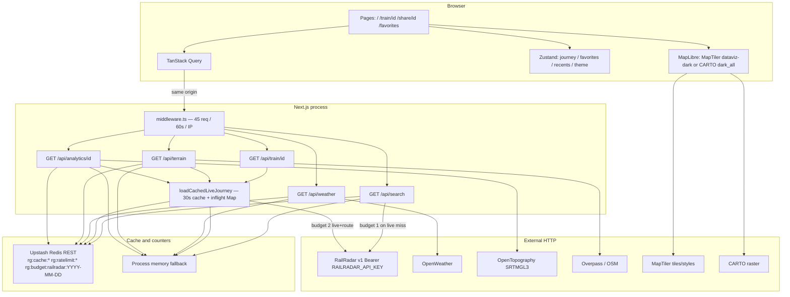

# Architecture diagram

Logical runtime of RailGaadi as implemented (Next.js 14, same-origin APIs, optional Redis).

Search hits Redis/memory only on the **live lookup** cache path (`search:live:*`), not for `TRAINS_DB` hits. Terrain and analytics also store their own TTLs (`terrain:*`, `analytics:*`) in addition to sharing `loadCachedLiveJourney`.
