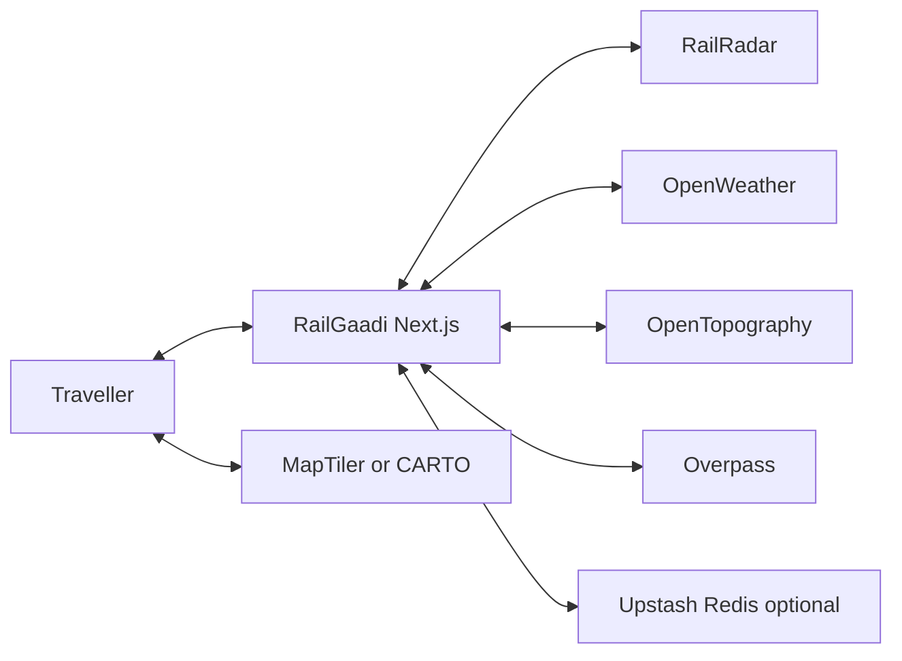
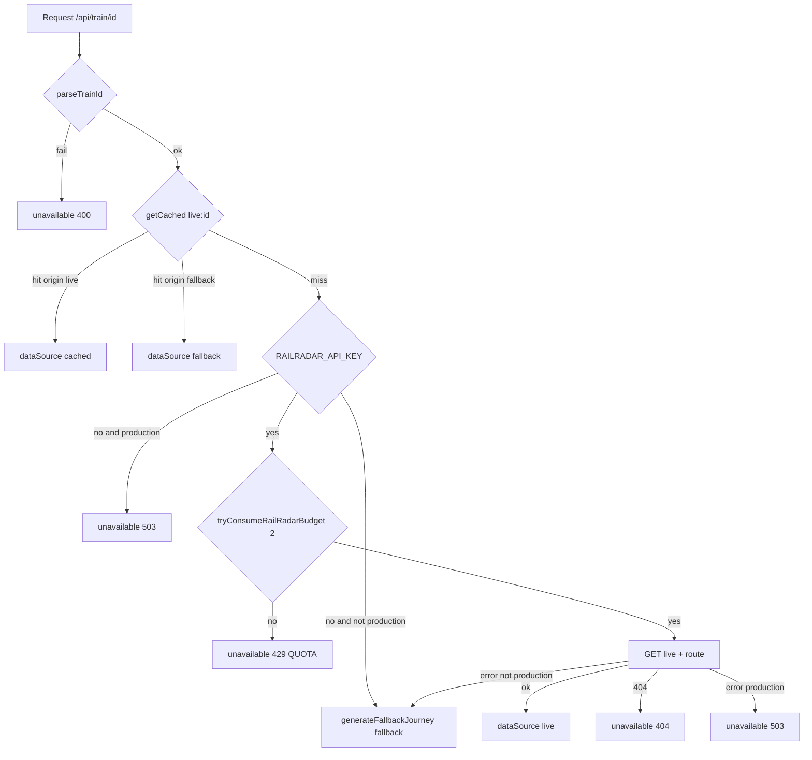

# Data-flow diagram

Context and level-1 flows for JSON `dataSource` labelling.

## Context

```mermaid
flowchart LR
  U[Traveller]
  RG[RailGaadi Next.js]
  RR[RailRadar]
  OW[OpenWeather]
  OT[OpenTopography]
  OP[Overpass]
  MAP[MapTiler or CARTO]
  RD[Upstash Redis optional]

  U <--> RG
  RG <--> RR
  RG <--> OW
  RG <--> OT
  RG <--> OP
  U <--> MAP
  RG <--> RD
```

## Envelope decision (journey)

```mermaid
flowchart TD
  A[Request /api/train/id] --> B{parseTrainId}
  B -->|fail| U[unavailable 400]
  B -->|ok| C{getCached live:id}
  C -->|hit origin live| K[dataSource cached]
  C -->|hit origin fallback| F[dataSource fallback]
  C -->|miss| D{RAILRADAR_API_KEY}
  D -->|no and not production| F2[generateFallbackJourney fallback]
  D -->|no and production| U2[unavailable 503]
  D -->|yes| E{tryConsumeRailRadarBudget 2}
  E -->|no| U3[unavailable 429 QUOTA]
  E -->|yes| G[GET live + route]
  G -->|ok| L[dataSource live]
  G -->|404| U4[unavailable 404]
  G -->|error not production| F2
  G -->|error production| U5[unavailable 503]
```
