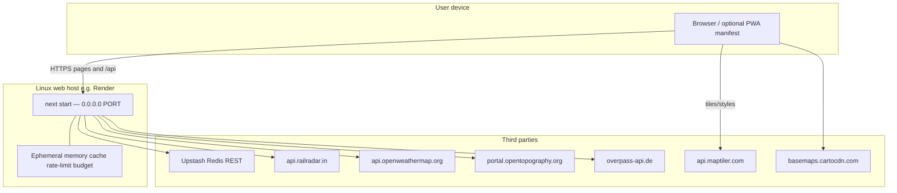

# Deployment diagram

Single Node.js service as implied by `package.json` (`next start`). No container file in repo.

**CI (not runtime):** GitHub Actions `ubuntu-latest` runs install, `tsc`, lint, Vitest, `next build` without production RailRadar/Upstash secrets.
