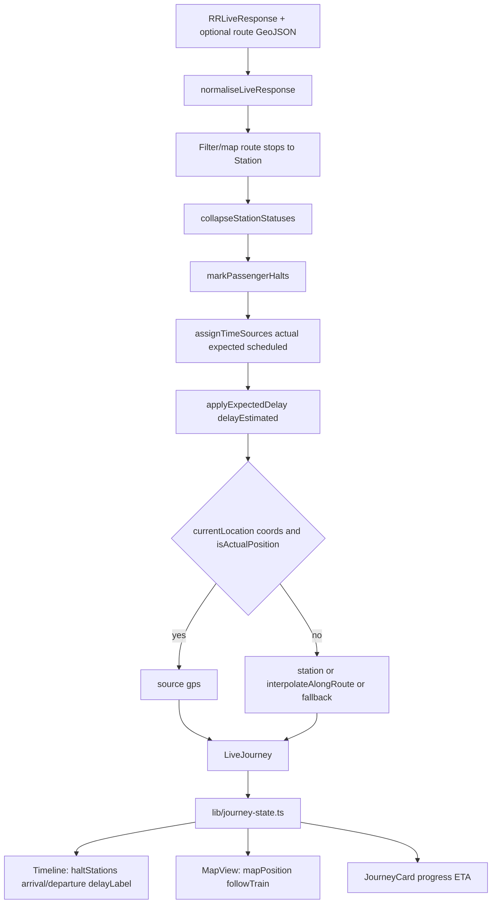

# Journey-state flow

From RailRadar `RRLiveResponse` to timeline and map views.

Time preference for display (`stationArrivalView`):

1. `arrivalSource === actual` → actual clock, label ACT  
2. `expected` → expected (or actual field if used), label EXP  
3. else scheduled, label SCH  

Position sources on `LiveLocation.source`: `gps | station | interpolated | fallback`.  
Progress: `gps | station | estimated`.
