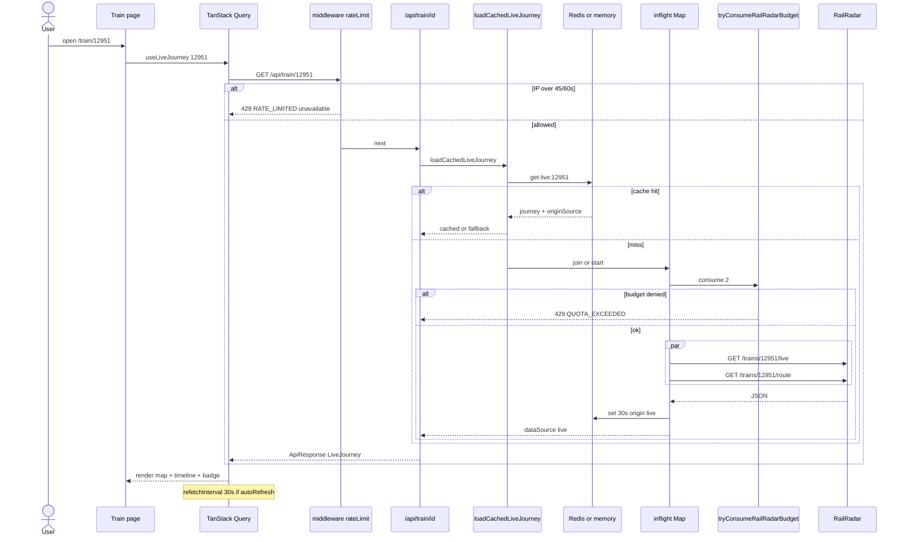

# Sequence: live tracking

Happy path and quota path for `GET /api/train/{id}` with auto-refresh.

```mermaid
sequenceDiagram
  actor User
  participant Page as Train page
  participant Q as TanStack Query
  participant MW as middleware rateLimit
  participant API as /api/train/id
  participant Loader as loadCachedLiveJourney
  participant Cache as Redis or memory
  participant Inflight as inflight Map
  participant Budget as tryConsumeRailRadarBudget
  participant RR as RailRadar

  User->>Page: open /train/12951
  Page->>Q: useLiveJourney 12951
  Q->>MW: GET /api/train/12951
  alt IP over 45/60s
    MW-->>Q: 429 RATE_LIMITED unavailable
  else allowed
    MW->>API: next
    API->>Loader: loadCachedLiveJourney
    Loader->>Cache: get live:12951
    alt cache hit
      Cache-->>Loader: journey + originSource
      Loader-->>API: cached or fallback
    else miss
      Loader->>Inflight: join or start
      Inflight->>Budget: consume 2
      alt budget denied
        Budget-->>API: 429 QUOTA_EXCEEDED
      else ok
        par
          Inflight->>RR: GET /trains/12951/live
          Inflight->>RR: GET /trains/12951/route
        end
        RR-->>Inflight: JSON
        Inflight->>Cache: set 30s origin live
        Inflight-->>API: dataSource live
      end
    end
    API-->>Q: ApiResponse LiveJourney
  end
  Q-->>Page: render map + timeline + badge
  Note over Q: refetchInterval 30s if autoRefresh
```
