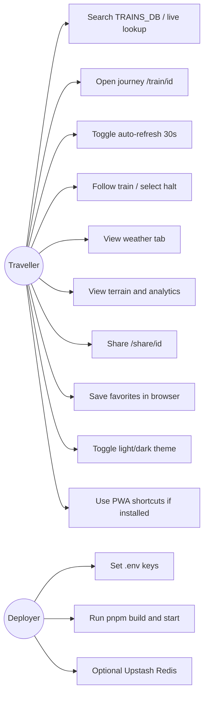

# Use-case diagram

Actors: unauthenticated **Traveller** and **Deployer** (configures env). No login use cases exist.

| Use case | Primary implementation |
| --- | --- |
| Search | `app/page.tsx`, `useTrainSearch`, `/api/search` |
| Journey | `app/train/[id]/page.tsx`, `useLiveJourney` |
| Auto-refresh | `AutoRefreshToggle`, `useJourneyStore.autoRefresh` |
| Map follow | `MapView`, `followTrainMode` |
| Weather | `WeatherPanel`, `/api/weather` |
| Analytics | `AnalyticsDashboard`, `/api/analytics/[id]`, `/api/terrain` |
| Share | `app/share/[id]/page.tsx` |
| Favorites | `store/favorites.ts` |
| Theme | `ThemeToggle`, `lib/theme.ts` |
| Deploy | `07-deployment-and-configuration.md` |
